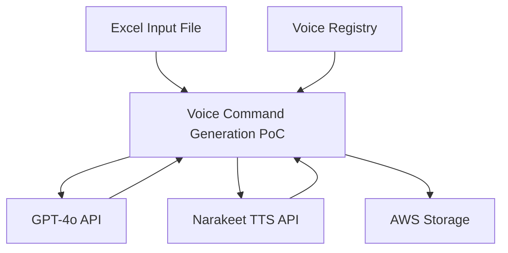
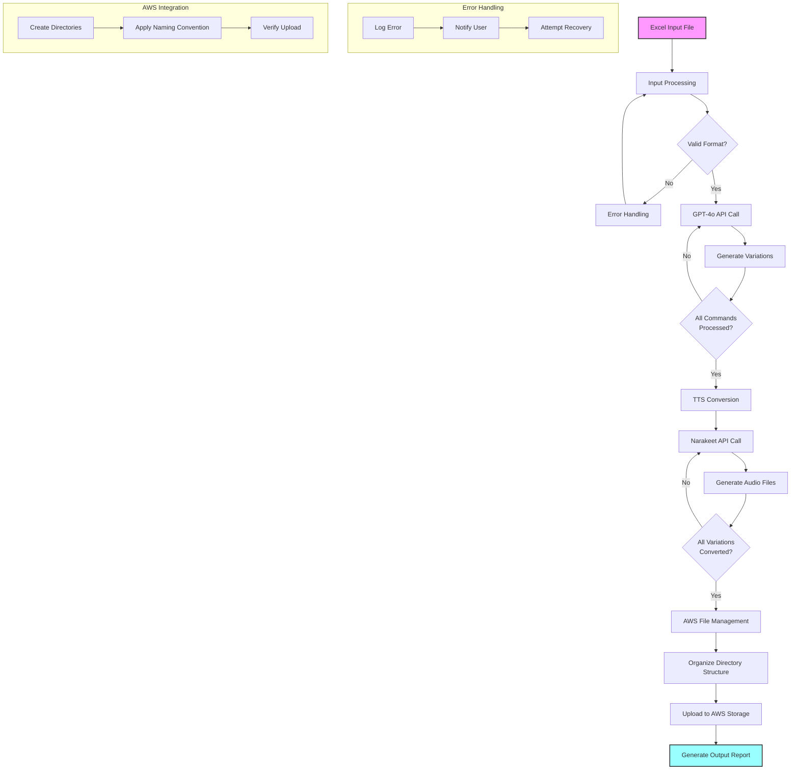
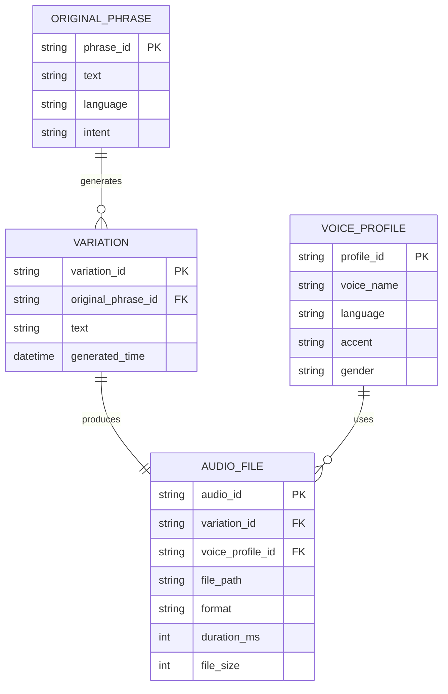
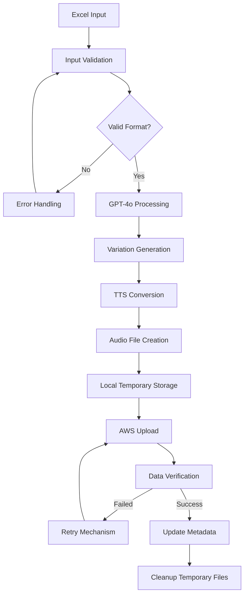
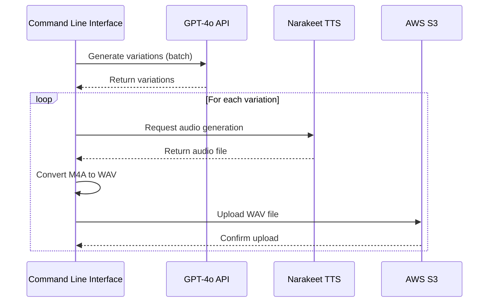

### 1. INTRODUCTION

### 1.1 PURPOSE

This Software Requirements Specification (SRS) document provides a comprehensive description of the Femtosense Voice Command Generation Proof of Concept (PoC) application. It is intended for:

- Development team members implementing the system
- Quality assurance testers validating the requirements
- Project managers overseeing development progress
- Femtosense stakeholders evaluating the proposed solution

The document outlines functional and non-functional requirements, system constraints, and interface specifications to ensure all parties have a clear understanding of the application's intended behavior and capabilities.

### 1.2 SCOPE

The Femtosense Voice Command Generation PoC is a specialized application designed to:

1. Generate diverse variations of voice commands using GPT-4o AI technology
2. Create high-quality audio files from these variations using Femtosense's Text-to-Speech (TTS) technology
3. Manage and organize the generated audio files using AWS infrastructure

Key functionalities include:

- Processing input Excel files containing original voice command phrases
- Generating multiple linguistically diverse variations for each command
- Supporting multiple languages including Korean, English, and Japanese
- Utilizing various voice profiles for audio generation
- Implementing AWS integration for scalable file storage and management

The system will benefit Femtosense by:

- Accelerating the development of robust voice recognition systems
- Providing a diverse dataset for training and testing voice models
- Demonstrating the capabilities of Femtosense's TTS technology
- Creating a foundation for future voice command processing applications

Out of scope items:
- Real-time voice command processing
- User interface for end consumers
- Integration with existing voice assistants
- Speech recognition capabilities

### 2. PRODUCT DESCRIPTION

### 2.1 PRODUCT PERSPECTIVE

The Femtosense Voice Command Generation PoC is a standalone application that interfaces with:

1. GPT-4o API for generating voice command variations
2. Narakeet API for text-to-speech conversion
3. AWS infrastructure for file storage and management

The system operates within the following context:
- Part of Femtosense's voice recognition technology development pipeline
- Complementary to existing voice processing and recognition systems
- Independent of but compatible with end-user voice assistant applications



### 2.2 PRODUCT FUNCTIONS

The primary functions of the system include:

1. Input Processing
   - Parse Excel files containing original voice commands
   - Validate input data format and content

2. Variation Generation
   - Interface with GPT-4o API
   - Generate 50 linguistically diverse variations per command
   - Ensure variations maintain original intent

3. Audio File Creation
   - Convert text variations to audio using Narakeet API
   - Support multiple voice profiles per language
   - Generate high-quality .wav files

4. File Management
   - Organize generated files in structured directories
   - Implement AWS integration for scalable storage
   - Maintain consistent naming conventions

5. Multi-language Support
   - Handle Korean, English, and Japanese commands
   - Utilize language-specific voice profiles
   - Ensure proper character encoding

### 2.3 USER CHARACTERISTICS

Primary users of the system are:

1. Voice Recognition Engineers
   - Technical expertise: High
   - Programming knowledge: Advanced
   - Needs: Large, diverse datasets for model training
   - Usage: Command line interface, data analysis

2. Machine Learning Researchers
   - Technical expertise: High
   - Domain knowledge: Voice recognition, linguistics
   - Needs: Controlled variation generation, quality audio samples
   - Usage: Data validation, model testing

3. Quality Assurance Testers
   - Technical expertise: Medium
   - Testing knowledge: Advanced
   - Needs: Consistent, reproducible outputs
   - Usage: Verification of generated variations

### 2.4 CONSTRAINTS

1. Technical Constraints
   - Limited to supported languages in voice registry
   - API rate limits for GPT-4o and Narakeet
   - Audio file format restricted to .wav
   - AWS storage capacity limitations

2. Quality Constraints
   - Generated variations must maintain original intent
   - Audio files must meet minimum quality standards
   - System must handle Unicode characters correctly

3. Performance Constraints
   - Processing time per variation limited to 5 seconds
   - Maximum 50 variations per original command
   - AWS file upload speed dependent on network conditions

4. Interface Constraints
   - Command-line interface only
   - Input limited to specific Excel format
   - Output directory structure must follow defined pattern

### 2.5 ASSUMPTIONS AND DEPENDENCIES

Assumptions:
1. GPT-4o API remains capable of generating contextually appropriate variations
2. Narakeet API continues to provide high-quality voice synthesis
3. AWS services remain available and compatible
4. Input Excel files follow the specified format
5. Users have necessary API keys and access credentials

Dependencies:
1. External Services
   - GPT-4o API availability and stability
   - Narakeet API functionality and voice profile availability
   - AWS infrastructure and services

2. Software Dependencies
   - Python 3.7 or higher
   - Required Python packages: requests, tqdm, csv
   - FFmpeg for audio file conversion

3. Data Dependencies
   - Voice registry configuration file
   - Predefined voice profiles for each language
   - Example and distractor CSV files

4. Network Dependencies
   - Stable internet connection for API calls
   - Sufficient bandwidth for audio file transfers

### 3. PROCESS FLOWCHART



### 4. FUNCTIONAL REQUIREMENTS

#### 4.1 Input Processing

##### ID: FR-1

##### DESCRIPTION
The system shall process Excel files containing original voice command phrases, validating and preparing them for variation generation.

##### PRIORITY
High

##### FUNCTIONAL REQUIREMENTS

| ID | Requirement | Acceptance Criteria |
|----|-------------|---------------------|
| FR-1.1 | Parse Excel input files containing original voice commands | - Successfully read .xlsx and .csv files<br>- Handle Unicode characters for multiple languages<br>- Validate file format and structure |
| FR-1.2 | Extract command phrases from the first row of the Excel file | - Correctly identify and extract all phrases<br>- Maintain column structure for organization |
| FR-1.3 | Validate input data format and content | - Check for empty cells or invalid characters<br>- Ensure phrases are within acceptable length<br>- Verify language compatibility |
| FR-1.4 | Map commands to intents based on Excel structure | - Create accurate phrase-to-intent mapping<br>- Handle multiple phrases per intent |

#### 4.2 Variation Generation

##### ID: FR-2

##### DESCRIPTION
The system shall utilize GPT-4o API to generate linguistically diverse variations of original voice commands while maintaining intent.

##### PRIORITY
Critical

##### FUNCTIONAL REQUIREMENTS

| ID | Requirement | Acceptance Criteria |
|----|-------------|---------------------|
| FR-2.1 | Interface with GPT-4o API for command variation generation | - Establish stable API connection<br>- Handle API rate limits and errors<br>- Implement retry mechanism for failed calls |
| FR-2.2 | Generate 50 unique variations per original command | - Ensure variations maintain original intent<br>- Provide linguistic diversity in variations<br>- Avoid duplicate or nonsensical variations |
| FR-2.3 | Implement custom prompt engineering for GPT-4o | - Optimize prompt for relevant and diverse outputs<br>- Include language-specific considerations<br>- Maintain consistent output format |
| FR-2.4 | Validate generated variations for quality and relevance | - Check for grammatical correctness<br>- Verify intent preservation<br>- Filter out inappropriate or irrelevant variations |

#### 4.3 Audio Generation

##### ID: FR-3

##### DESCRIPTION
The system shall create high-quality audio files for each command variation using Narakeet API, supporting multiple languages and voice profiles.

##### PRIORITY
High

##### FUNCTIONAL REQUIREMENTS

| ID | Requirement | Acceptance Criteria |
|----|-------------|---------------------|
| FR-3.1 | Interface with Narakeet API for text-to-speech conversion | - Establish reliable API connection<br>- Handle API authentication and errors<br>- Support multiple concurrent requests |
| FR-3.2 | Generate .wav audio files for each command variation | - Produce high-quality audio output<br>- Ensure consistent audio format and settings<br>- Verify audio file integrity |
| FR-3.3 | Support multiple voice profiles per language | - Utilize voice registry for profile selection<br>- Apply appropriate voice profile based on language<br>- Allow for voice profile customization |
| FR-3.4 | Implement audio quality control measures | - Verify audio clarity and pronunciation<br>- Check for appropriate volume levels<br>- Ensure consistent audio duration |

#### 4.4 File Management

##### ID: FR-4

##### DESCRIPTION
The system shall organize and manage generated audio files using AWS infrastructure, implementing consistent naming conventions and directory structures.

##### PRIORITY
Medium

##### FUNCTIONAL REQUIREMENTS

| ID | Requirement | Acceptance Criteria |
|----|-------------|---------------------|
| FR-4.1 | Create structured directory hierarchy for audio files | - Organize files by language, intent, and variation<br>- Implement consistent naming convention<br>- Handle special characters in file names |
| FR-4.2 | Integrate with AWS for file storage and management | - Configure AWS credentials and access<br>- Implement efficient file upload mechanism<br>- Handle upload failures and retries |
| FR-4.3 | Generate output reports for file management | - Create logs of generated files<br>- Provide summary statistics<br>- Include file locations and metadata |
| FR-4.4 | Implement file versioning and backup mechanisms | - Track file versions and changes<br>- Provide rollback capability<br>- Ensure data redundancy |

#### 4.5 Multi-language Support

##### ID: FR-5

##### DESCRIPTION
The system shall support voice command generation in multiple languages, ensuring proper character encoding and language-specific considerations.

##### PRIORITY
High

##### FUNCTIONAL REQUIREMENTS

| ID | Requirement | Acceptance Criteria |
|----|-------------|---------------------|
| FR-5.1 | Support Korean, English, and Japanese languages | - Handle Unicode characters correctly<br>- Apply language-specific grammar rules<br>- Ensure proper character rendering |
| FR-5.2 | Implement language detection and validation | - Accurately identify input language<br>- Validate language compatibility<br>- Handle mixed-language inputs |
| FR-5.3 | Provide language-specific voice profiles | - Map voices to appropriate languages<br>- Support multiple voices per language<br>- Allow for accent variations |
| FR-5.4 | Generate language-appropriate variations | - Consider cultural and linguistic nuances<br>- Maintain natural language patterns<br>- Support language-specific idioms |

### 5. NON-FUNCTIONAL REQUIREMENTS

#### 5.1 PERFORMANCE

| ID | Requirement | Metric |
|----|-------------|--------|
| NFR-P1 | GPT-4o API response time | - Average response time ≤ 3 seconds per variation<br>- 95th percentile response time ≤ 5 seconds |
| NFR-P2 | Narakeet TTS conversion speed | - Average conversion time ≤ 2 seconds per audio file<br>- Process up to 10 concurrent TTS requests |
| NFR-P3 | AWS file upload performance | - Minimum upload speed of 10 MB/s<br>- Support batch uploading of 100 files simultaneously |
| NFR-P4 | System resource utilization | - CPU usage ≤ 70% during peak operation<br>- Memory usage ≤ 2GB<br>- Disk I/O ≤ 50 MB/s |
| NFR-P5 | End-to-end processing time | - Complete processing of 50 variations within 5 minutes per original phrase |

#### 5.2 SAFETY

| ID | Requirement | Implementation |
|----|-------------|----------------|
| NFR-S1 | Data backup and recovery | - Automated backups of generated files every 6 hours<br>- Recovery time objective (RTO) of 1 hour<br>- Recovery point objective (RPO) of 6 hours |
| NFR-S2 | Graceful error handling | - Implement comprehensive error logging<br>- Provide meaningful error messages<br>- Ensure system stability during API failures |
| NFR-S3 | Input validation | - Sanitize all input data before processing<br>- Implement maximum length restrictions for phrases<br>- Validate file formats and content |
| NFR-S4 | Resource monitoring | - Implement automated alerts for resource exhaustion<br>- Graceful shutdown procedures for critical failures |
| NFR-S5 | Data integrity checks | - Verify audio file integrity after generation<br>- Implement checksums for file validation |

#### 5.3 SECURITY

| ID | Requirement | Implementation |
|----|-------------|----------------|
| NFR-SE1 | API authentication | - Secure storage of API keys<br>- Implement key rotation mechanism<br>- Use environment variables for sensitive data |
| NFR-SE2 | Data encryption | - Encrypt data in transit using TLS 1.3<br>- Implement AWS S3 server-side encryption<br>- Secure local temporary files |
| NFR-SE3 | Access control | - Implement role-based access control for AWS resources<br>- Principle of least privilege for API access<br>- Audit logging of all access attempts |
| NFR-SE4 | Secure file handling | - Implement secure file deletion after processing<br>- Use secure temporary directories<br>- Sanitize file names and paths |
| NFR-SE5 | Compliance with privacy regulations | - Implement data retention policies<br>- Provide mechanisms for data deletion<br>- Document data handling procedures |

#### 5.4 QUALITY

| Attribute | ID | Requirement | Metric |
|-----------|-------|-------------|--------|
| Availability | NFR-Q1 | System uptime | - 99.9% availability during business hours<br>- Scheduled maintenance windows<br>- Maximum unplanned downtime of 1 hour per month |
| Maintainability | NFR-Q2 | Code quality | - Maintain code coverage ≥ 80%<br>- Documentation for all major functions<br>- Adherence to PEP 8 style guide |
| Usability | NFR-Q3 | User interaction | - Clear command-line interface<br>- Comprehensive error messages<br>- Progress indicators for long operations |
| Scalability | NFR-Q4 | System growth | - Support up to 1000 original phrases per batch<br>- Handle up to 50,000 audio files per day<br>- Linear scaling of processing time |
| Reliability | NFR-Q5 | System stability | - Mean Time Between Failures (MTBF) ≥ 720 hours<br>- Automatic retry mechanism for failed API calls<br>- Data consistency checks |

#### 5.5 COMPLIANCE

| ID | Requirement | Implementation |
|----|-------------|----------------|
| NFR-C1 | Audio file format standards | - Generate .wav files compliant with IEEE 1857.2-2013<br>- Implement proper audio metadata<br>- Verify format compatibility |
| NFR-C2 | Data privacy compliance | - Comply with GDPR requirements for data handling<br>- Implement data minimization principles<br>- Provide audit trails for data processing |
| NFR-C3 | API usage compliance | - Adhere to GPT-4o API terms of service<br>- Comply with Narakeet API usage guidelines<br>- Implement proper API rate limiting |
| NFR-C4 | AWS best practices | - Follow AWS Well-Architected Framework<br>- Implement AWS security best practices<br>- Maintain compliance with AWS service limits |
| NFR-C5 | Documentation standards | - Maintain up-to-date API documentation<br>- Follow standard docstring formats<br>- Provide comprehensive README files |

### 6. DATA REQUIREMENTS

#### 6.1 DATA MODELS

The system utilizes the following data structures and relationships:



#### 6.2 DATA STORAGE

##### 6.2.1 Storage Requirements

| Data Type | Storage Format | Estimated Size | Growth Rate |
|-----------|----------------|----------------|-------------|
| Original Phrases | CSV/Excel files | 1-5 MB | 100 KB/month |
| Variations | JSON | 10-50 MB | 1 MB/month |
| Audio Files | .wav | 500 MB - 2 GB | 100 MB/month |
| Voice Profiles | Python dictionary | < 1 MB | Static |

##### 6.2.2 Data Retention and Redundancy

1. Short-term Storage
   - Local temporary storage for processing
   - Deleted after successful AWS upload
   - Maximum retention: 24 hours

2. Long-term Storage
   - AWS S3 with Standard storage class
   - Lifecycle policies:
     - Move to S3 Infrequent Access after 30 days
     - Archive to Glacier after 90 days

3. Redundancy
   - AWS S3 cross-region replication
   - Local backup of original phrases and voice registry

##### 6.2.3 Backup and Recovery

| Backup Type | Frequency | Retention | Recovery Time Objective |
|-------------|-----------|-----------|------------------------|
| Original Phrases | Daily | 30 days | < 1 hour |
| Generated Variations | Weekly | 90 days | < 4 hours |
| Audio Files | Continuous | 1 year | < 24 hours |
| System Configuration | On change | 5 versions | < 1 hour |

#### 6.3 DATA PROCESSING

##### 6.3.1 Data Flow



##### 6.3.2 Data Security

1. Data in Transit
   - TLS 1.3 encryption for all API communications
   - Secure file transfer using AWS SDK

2. Data at Rest
   - AWS S3 server-side encryption (AES-256)
   - Local file encryption using system keyring

3. Access Control
   - AWS IAM roles and policies
   - Principle of least privilege
   - API key rotation every 90 days

4. Data Sanitization
   - Input validation and sanitization
   - Secure file naming conventions
   - Metadata scrubbing before storage

##### 6.3.3 Processing Requirements

| Process | Max Processing Time | Retry Attempts | Error Handling |
|---------|---------------------|----------------|----------------|
| Input Validation | 5 seconds | 3 | Log and notify |
| Variation Generation | 3 seconds/variation | 5 | Skip and continue |
| Audio Conversion | 2 seconds/file | 3 | Fallback voice |
| AWS Upload | 5 seconds/file | 5 | Local queue |

##### 6.3.4 Data Quality Controls

1. Input Validation
   - Check for empty or malformed phrases
   - Verify language compatibility
   - Ensure intent mapping

2. Variation Quality
   - Semantic similarity check
   - Grammatical validation
   - Duplicate detection

3. Audio Quality
   - Minimum duration check (500ms)
   - Maximum duration check (5s)
   - Audio level normalization

4. Storage Verification
   - Checksum validation
   - File integrity checks
   - Metadata completeness verification

### 7. EXTERNAL INTERFACES

#### 7.1 USER INTERFACES

The Femtosense Voice Command Generation PoC utilizes a command-line interface (CLI) for user interaction:

1. Command Structure
```
python narakeet_generate_stt.py [options]

Options:
--apikey        Narakeet API key
--language      Target language (Korean, English, Japanese)
--intent_csv    Path to input CSV file
--outdir        Output directory for generated files
--skip_header   Number of header lines to skip (default: 1)
```

2. Input Requirements
- Excel/CSV file format:
```
Intent, Phrase
turn_on_lights, 불 켜줘
turn_off_lights, 조명을 꺼주세요
```

3. Output Display
- Progress indicators using tqdm library
- Status messages for:
  - Directory creation
  - Voice processing progress
  - File generation completion
  - Error notifications

4. Error Handling
- Clear error messages for:
  - Invalid API keys
  - Malformed input files
  - Network connection issues
  - Insufficient permissions

#### 7.2 SOFTWARE INTERFACES

1. GPT-4o API Interface
   
| Aspect | Specification |
|--------|---------------|
| Protocol | HTTPS REST API |
| Authentication | API key in request header |
| Request Format | JSON payload |
| Response Format | JSON response |
| Rate Limiting | 10 requests per second |
| Timeout | 30 seconds |

2. Narakeet Text-to-Speech API

| Aspect | Specification |
|--------|---------------|
| Base URL | https://api.narakeet.com/text-to-speech/m4a |
| Authentication | x-api-key header |
| Request Method | POST |
| Content Type | text/plain |
| Response Format | application/octet-stream (audio file) |
| Supported Formats | M4A (converted to WAV) |

3. AWS S3 Interface

| Component | Specification |
|-----------|---------------|
| SDK | AWS SDK for Python (Boto3) |
| Authentication | AWS IAM credentials |
| Bucket Structure | Organized by language/intent/variation |
| File Naming | `{voice_id}_{timestamp}.wav` |
| Metadata | Intent, language, generation parameters |

#### 7.3 COMMUNICATION INTERFACES

1. Network Requirements

| Requirement | Specification |
|-------------|---------------|
| Bandwidth | Minimum 5 Mbps upload/download |
| Latency | Maximum 200ms to API endpoints |
| Protocol | HTTPS (TLS 1.2 or higher) |
| Ports | 443 (HTTPS) |

2. Data Formats

| Interface | Format | Schema |
|-----------|--------|--------|
| Input CSV | UTF-8 encoded CSV | `intent,phrase` |
| API Requests | JSON | `{"text": string, "voice": string}` |
| Audio Output | WAV | 16-bit PCM, 44.1kHz |
| Log Files | Plain text | ISO 8601 timestamps |

3. Error Communication

| Error Type | Communication Method |
|------------|---------------------|
| API Errors | HTTP status codes with JSON error details |
| File Errors | Exception messages to stdout |
| Network Errors | Retry mechanism with exponential backoff |

4. Batch Processing Protocol



### 8. APPENDICES

#### 8.1 GLOSSARY

| Term | Definition |
|------|------------|
| Voice Registry | A dictionary mapping languages to available voice profiles for text-to-speech conversion |
| Distractor Phrase | A phrase similar to a target command but intended to test system discrimination |
| Voice Profile | A specific voice identity used for audio generation, characterized by language, accent, and gender |
| Intent | The underlying purpose or action associated with a voice command |
| Variation | A different phrasing of the same command that maintains the original intent |

#### 8.2 ACRONYMS

| Acronym | Expanded Form |
|---------|---------------|
| API | Application Programming Interface |
| AWS | Amazon Web Services |
| CLI | Command Line Interface |
| CSV | Comma-Separated Values |
| GPT | Generative Pre-trained Transformer |
| PoC | Proof of Concept |
| S3 | Simple Storage Service |
| STT | Speech-to-Text |
| TTS | Text-to-Speech |
| WAV | Waveform Audio File Format |

#### 8.3 ADDITIONAL REFERENCES

1. FFmpeg Documentation
   - URL: https://ffmpeg.org/documentation.html
   - Relevance: Required for audio file format conversion

2. Narakeet API Documentation
   - Relevance: Essential for understanding TTS API integration

3. Python Libraries
   - requests: HTTP library for API calls
   - tqdm: Progress bar implementation
   - pathlib: Object-oriented filesystem paths

#### 8.4 COMMAND LINE INTERFACE

```
python narakeet_generate_stt.py [options]

Required Arguments:
  --apikey APIKEY         Narakeet API key
  --language LANGUAGE     Language for voice generation (korean, english, japanese)
  --intent_csv FILE       CSV file containing intent/phrase definitions
  --outdir DIRECTORY     Output directory for generated files

Optional Arguments:
  --skip_header N        Number of header lines to skip in CSV (default: 1)
```

Example usage:
```
python narakeet_generate_stt.py --apikey PJNGN13Xbg17xtqe45CtG6PgfZsdgqE99NErygvy --language Korean --intent_csv example.csv --outdir test --skip_header 1
```

#### 8.5 FILE FORMATS

1. Input CSV Structure
```
Intent, Phrase
turn_on_lights, 불 켜줘
turn_off_lights, 조명을 꺼주세요
```

2. Distractor CSV Structure
```
Korean,English
불이 켜져 있는 것 같아요.,It seems like the lights are on.
누가 조명 스위치를 보았어요?,Who saw the light switch?
```

3. Output Directory Structure
```
outdir/
├── INTENT1/
│   ├── phrase1-variation1/
│   │   ├── voice1.wav
│   │   ├── voice2.wav
│   ├── phrase1-variation2/
│   │   ├── voice1.wav
│   │   ├── voice2.wav
├── INTENT2/
    ├── phrase2-variation1/
    │   ├── voice1.wav
    │   ├── voice2.wav
```

#### 8.6 VOICE PROFILE AVAILABILITY

| Language | Number of Voices | Accent Variations |
|----------|------------------|-------------------|
| Korean | 14 | Standard Korean |
| English | 180+ | UK, US, Canada, Scottish, Welsh, Australian, New Zealand, Irish, Indian, South African, Nigerian, Filipino |
| Japanese | 14 | Standard Japanese |