### 1. INTRODUCTION

#### 1.1 SYSTEM OBJECTIVES

The Femtosense Voice Command Generation Proof of Concept (PoC) system aims to achieve the following key objectives:

1. Automated Voice Command Variation Generation
   - Create linguistically diverse yet semantically consistent variations of voice commands
   - Leverage GPT-4o AI technology for intelligent phrase generation
   - Support multiple languages including Korean, English, and Japanese

2. High-Quality Audio Dataset Creation
   - Generate professional-grade audio files using Femtosense's Text-to-Speech technology
   - Utilize diverse voice profiles for comprehensive training data
   - Ensure consistent audio quality across all generated files

3. Scalable Data Management
   - Implement robust AWS-based storage solution
   - Organize generated data in a structured, easily accessible format
   - Enable efficient retrieval and management of large audio datasets

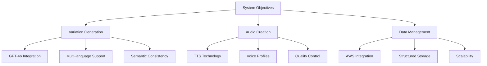

#### 1.2 SCOPE

The Femtosense Voice Command Generation PoC encompasses the development of a specialized system for creating diverse, high-quality voice command datasets. This section outlines the scope of the project:

##### 1.2.1 Core Functionalities

| Functionality | In Scope | Out of Scope |
|---------------|----------|--------------|
| Input Processing | - Excel/CSV file parsing<br>- Multi-language support<br>- Intent mapping | - Real-time voice input<br>- Custom file formats<br>- Natural language processing |
| Variation Generation | - GPT-4o integration<br>- 50 variations per command<br>- Intent preservation | - User-defined variation rules<br>- Real-time variation generation<br>- Semantic analysis tools |
| Audio Generation | - Narakeet TTS integration<br>- Multiple voice profiles<br>- WAV file format | - Custom voice creation<br>- Real-time audio streaming<br>- Audio editing features |
| Data Management | - AWS S3 storage<br>- Structured file organization<br>- Basic metadata | - Advanced search capabilities<br>- User interface for browsing<br>- Analytics dashboard |

##### 1.2.2 System Benefits

1. Development Acceleration
   - Rapid generation of diverse training datasets
   - Automated workflow for voice command variation
   - Reduced manual effort in dataset creation

2. Quality Assurance
   - Consistent audio quality across datasets
   - Controlled variation generation
   - Structured data organization

3. Scalability
   - Cloud-based storage solution
   - Support for multiple languages
   - Extensible architecture for future enhancements

##### 1.2.3 Limitations and Constraints

| Category | Limitation |
|----------|------------|
| Technical | - Limited to supported languages in voice registry<br>- API rate limits for GPT-4o and Narakeet<br>- WAV file format only |
| Operational | - Command-line interface only<br>- Batch processing (no real-time generation)<br>- Requires internet connectivity |
| Data | - Fixed number of variations per command<br>- Predefined voice profiles<br>- No user-defined voice creation |

##### 1.2.4 Future Extensibility

While maintaining a focused scope for the PoC, the system architecture allows for future enhancements:

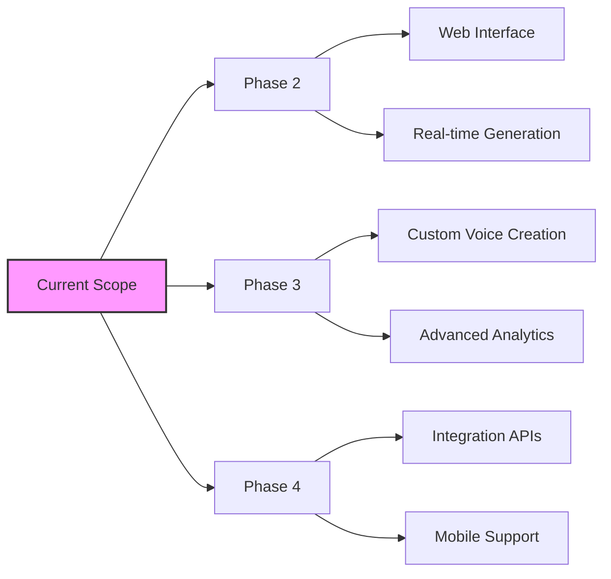

The system's modular design ensures that future enhancements can be implemented without significant restructuring of the core functionality.

### 3. SYSTEM ARCHITECTURE

#### 3.1 PROGRAMMING LANGUAGES

| Language | Purpose | Justification |
|----------|---------|---------------|
| Python 3.7+ | Primary development language | - Extensive libraries for API integration (requests, boto3)<br>- Strong text processing capabilities for handling multiple languages<br>- Excellent support for AWS services<br>- Simple and readable syntax for rapid PoC development |
| Bash | Scripting and automation | - Efficient for file system operations<br>- Seamless integration with command-line tools like FFmpeg<br>- Facilitates automated testing and deployment |

#### 3.2 HIGH-LEVEL ARCHITECTURE DIAGRAM

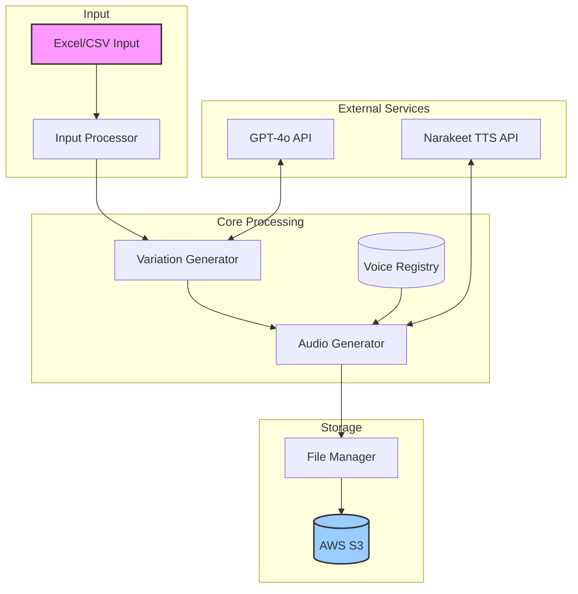

#### 3.3 COMPONENT DIAGRAMS

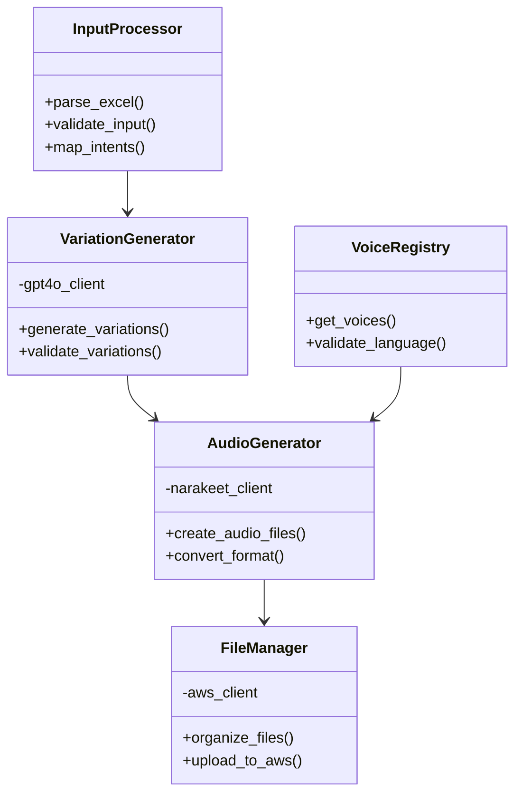

#### 3.4 SEQUENCE DIAGRAMS

##### 3.4.1 Voice Command Generation Sequence

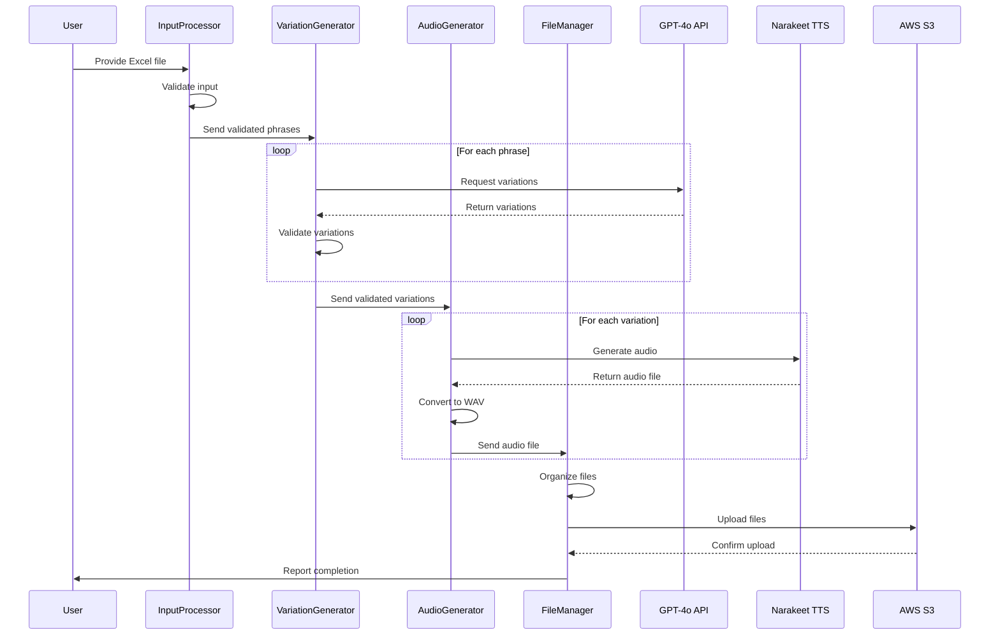

#### 3.5 DATA-FLOW DIAGRAM

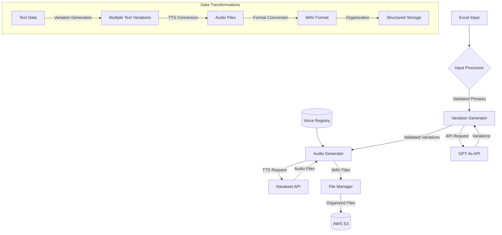

#### 3.6 COMPONENT DETAILS

1. Input Processor
   - Handles Excel/CSV parsing using pandas library
   - Implements validation logic for input data
   - Maps phrases to intents based on file structure

2. Variation Generator
   - Manages GPT-4o API interactions
   - Implements retry mechanism with exponential backoff
   - Ensures semantic consistency of generated variations

3. Audio Generator
   - Interfaces with Narakeet TTS API
   - Handles audio format conversion using FFmpeg
   - Implements voice profile selection logic

4. File Manager
   - Creates consistent directory structure
   - Manages AWS S3 interactions using boto3
   - Implements file naming conventions and metadata

5. Voice Registry
   - Maintains mapping of languages to available voices
   - Provides voice selection logic based on language
   - Ensures voice compatibility for audio generation

### 2. SYSTEM DESIGN

#### 2.1 PROGRAMMING LANGUAGES

| Language | Purpose | Justification |
|----------|---------|---------------|
| Python 3.7+ | Primary development language | - Extensive libraries for API integration (requests, boto3)<br>- Strong text processing capabilities<br>- Excellent AWS SDK support<br>- Simple syntax for rapid PoC development<br>- Native Unicode handling for multi-language support |
| Bash | Scripting and automation | - Efficient for file system operations<br>- Seamless integration with FFmpeg<br>- Facilitates automated testing and deployment<br>- Cross-platform compatibility |

#### 2.2 DATABASE DESIGN

For this PoC, a traditional database is not required. Instead, the system utilizes a file-based storage approach:

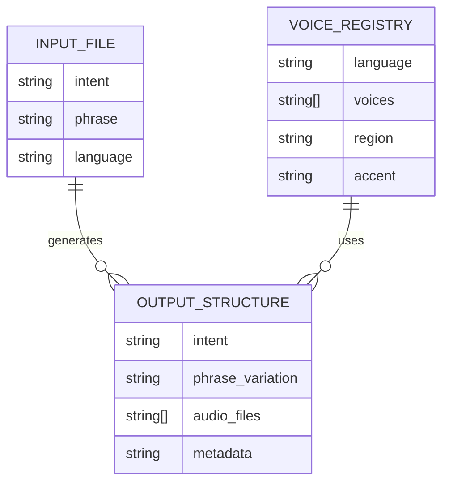

File Storage Organization:
```
aws_s3_bucket/
├── {language}/
│   ├── {intent}/
│   │   ├── {phrase_variation}/
│   │   │   ├── {voice_id}.wav
│   │   │   ├── metadata.json
```

#### 2.3 API DESIGN

##### 2.3.1 External API Interfaces

1. GPT-4o API

```python
def generate_variations(phrase: str, count: int = 50) -> List[str]:
    url = "https://api.openai.com/v1/completions"
    headers = {
        "Authorization": f"Bearer {GPT4O_API_KEY}",
        "Content-Type": "application/json"
    }
    payload = {
        "model": "gpt-4",
        "prompt": f"Generate {count} natural variations of: {phrase}",
        "max_tokens": 1000
    }
    response = requests.post(url, headers=headers, json=payload)
    return parse_gpt_response(response.json())
```

2. Narakeet TTS API

```python
def generate_audio(text: str, voice: str) -> bytes:
    url = f"https://api.narakeet.com/text-to-speech/m4a?voice={voice}"
    headers = {
        "x-api-key": NARAKEET_API_KEY,
        "Content-Type": "text/plain"
    }
    response = requests.post(url, headers=headers, data=text.encode('utf8'))
    return response.content
```

##### 2.3.2 Internal Module Interfaces

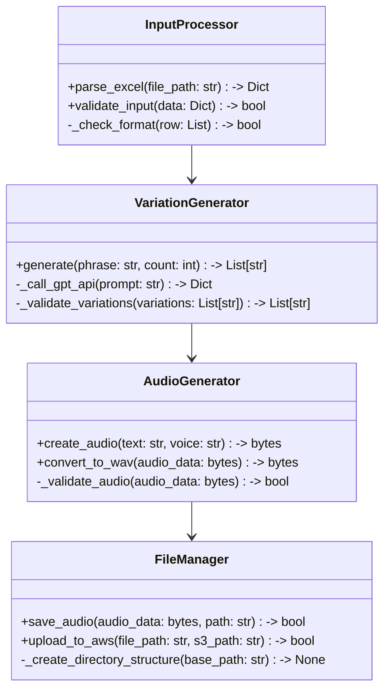

#### 2.4 USER INTERFACE DESIGN

As this is a command-line tool, the user interface consists of terminal interactions:

```
$ python narakeet_generate_stt.py --help

Usage: narakeet_generate_stt.py [OPTIONS]

Options:
  --apikey TEXT       Narakeet API key [required]
  --language TEXT     Target language (korean, english, japanese) [required]
  --intent_csv PATH   Path to input CSV file [required]
  --outdir PATH       Output directory for generated files [required]
  --skip_header INT   Number of header lines to skip [default: 1]
  --help             Show this message and exit

Example:
  python narakeet_generate_stt.py \
    --apikey PJNGN13Xbg17xtqe45CtG6PgfZsdgqE99NErygvy \
    --language korean \
    --intent_csv example.csv \
    --outdir test
```

Progress Display:
```
[1/3] Processing input file: example.csv
  100%|██████████| 10/10 phrases loaded

[2/3] Generating variations
  45%|████▌     | 225/500 variations generated

[3/3] Creating audio files
  12%|█▏        | 60/500 files generated

Uploading to AWS S3...
  78%|███████▊  | 390/500 files uploaded
```

#### 2.5 THEME DESIGN

While this is a command-line tool without a graphical interface, we maintain consistent styling in output and logging:

1. Color Scheme
```python
class Colors:
    SUCCESS = '\033[92m'  # Green
    WARNING = '\033[93m'  # Yellow
    ERROR = '\033[91m'    # Red
    INFO = '\033[94m'     # Blue
    RESET = '\033[0m'     # Reset
```

2. Output Formatting
```python
def log_success(message: str):
    print(f"{Colors.SUCCESS}✓ {message}{Colors.RESET}")

def log_error(message: str):
    print(f"{Colors.ERROR}✗ Error: {message}{Colors.RESET}")

def log_progress(current: int, total: int, prefix: str = ''):
    percentage = (current / total) * 100
    bar_length = 50
    filled_length = int(bar_length * current // total)
    bar = '█' * filled_length + '-' * (bar_length - filled_length)
    print(f'\r{prefix} |{bar}| {percentage:.1f}% Complete', end='')
```

3. Log File Format
```
[2023-11-15 14:30:22] INFO: Starting voice command generation
[2023-11-15 14:30:23] DEBUG: Loaded 10 phrases from example.csv
[2023-11-15 14:30:25] WARNING: API rate limit approaching
[2023-11-15 14:30:30] ERROR: Failed to generate audio for phrase: "불 켜줘"
```

### 4. TECHNOLOGY STACK

#### 4.1 PROGRAMMING LANGUAGES

| Language | Version | Purpose | Justification |
|----------|---------|---------|---------------|
| Python | 3.7+ | Primary development language | - Extensive libraries for API integration (requests, boto3)<br>- Strong text processing capabilities<br>- Excellent AWS SDK support<br>- Simple syntax for rapid PoC development<br>- Native Unicode handling for multi-language support |
| Bash | 5.0+ | Scripting and automation | - Efficient for file system operations<br>- Seamless integration with FFmpeg<br>- Facilitates automated testing and deployment<br>- Cross-platform compatibility |

#### 4.2 FRAMEWORKS AND LIBRARIES

| Category | Library | Version | Purpose |
|----------|---------|---------|---------|
| HTTP Client | requests | 2.26.0+ | - API interactions with GPT-4o and Narakeet<br>- Robust error handling and retry mechanisms |
| AWS SDK | boto3 | 1.24.0+ | - AWS S3 integration<br>- Efficient file upload and management |
| Progress Tracking | tqdm | 4.62.0+ | - User-friendly progress indicators<br>- Estimated time remaining for operations |
| Audio Processing | FFmpeg | 4.4+ | - Audio format conversion (M4A to WAV)<br>- Consistent audio quality across files |
| File Handling | pathlib | Built-in | - Object-oriented filesystem paths<br>- Cross-platform compatibility |
| Data Processing | pandas | 1.3.0+ | - Excel/CSV file parsing<br>- Efficient data manipulation |

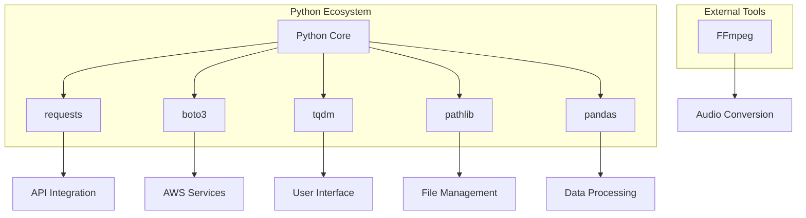

#### 4.3 DATABASES

For this PoC, a traditional database system is not required. Instead, the system utilizes a file-based storage approach:

| Storage Type | Purpose | Implementation |
|--------------|---------|----------------|
| Local Temporary Storage | Intermediate processing | - System temporary directory<br>- Structured by processing stage<br>- Automatically cleaned up |
| AWS S3 | Long-term storage | - Bucket organization by language/intent<br>- Metadata stored in object tags<br>- Lifecycle policies for cost optimization |

File Storage Organization:
```
aws_s3_bucket/
├── {language}/
│   ├── {intent}/
│   │   ├── {phrase_variation}/
│   │   │   ├── {voice_id}.wav
│   │   │   ├── metadata.json
```

#### 4.4 THIRD-PARTY SERVICES

| Service | Purpose | Integration Details |
|---------|---------|---------------------|
| GPT-4o API | Variation generation | - RESTful API integration<br>- Authentication via API key<br>- Rate limiting: 10 requests/second<br>- Timeout: 30 seconds |
| Narakeet TTS API | Audio file generation | - RESTful API integration<br>- Authentication via x-api-key header<br>- Supports multiple voice profiles<br>- Output format: M4A (converted to WAV) |
| AWS S3 | File storage and management | - Integration via boto3 SDK<br>- IAM role-based authentication<br>- Server-side encryption (AES-256)<br>- Cross-region replication for redundancy |

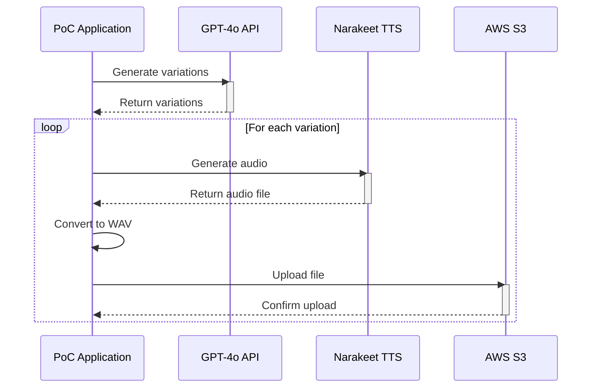

### 6. SECURITY CONSIDERATIONS

#### 6.1 AUTHENTICATION AND AUTHORIZATION

| Security Layer | Implementation | Details |
|----------------|----------------|---------|
| API Authentication | API Key Management | - Secure storage of API keys in environment variables<br>- Regular key rotation (90-day cycle)<br>- Separate keys for development and production |
| AWS Access | IAM Roles and Policies | - Role-based access control for S3 operations<br>- Principle of least privilege<br>- Temporary credentials using AWS STS |
| Local System Access | File Permissions | - Restricted access to output directories<br>- Executable permissions only for required scripts<br>- Secure handling of temporary files |

Authorization Matrix:
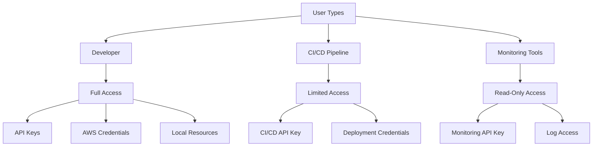

#### 6.2 DATA SECURITY

| Data State | Security Measure | Implementation |
|------------|------------------|----------------|
| Data at Rest | Encryption | - AWS S3 server-side encryption (AES-256)<br>- Local file encryption using system keyring<br>- Secure deletion of temporary files |
| Data in Transit | TLS Encryption | - HTTPS for all API communications<br>- TLS 1.3 for AWS SDK interactions<br>- Certificate validation for all connections |
| Data Processing | Secure Memory Handling | - Clearing sensitive data from memory after use<br>- Avoiding writing sensitive data to disk<br>- Input sanitization to prevent injection attacks |

Data Flow Security:
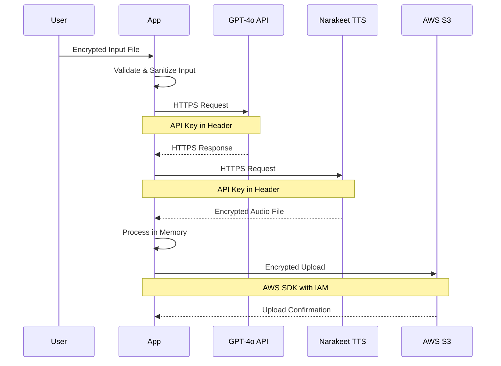

#### 6.3 SECURITY PROTOCOLS

##### 6.3.1 Operational Security

| Protocol | Description | Implementation |
|----------|-------------|----------------|
| Logging | Security event tracking | - Detailed logging of all API interactions<br>- AWS CloudWatch integration for S3 access logs<br>- Regular log analysis for security incidents |
| Monitoring | System security oversight | - Real-time alerting for unauthorized access attempts<br>- Monitoring of API key usage and quotas<br>- AWS CloudTrail for AWS API activity tracking |
| Incident Response | Security incident handling | - Defined procedures for potential security breaches<br>- Automated key revocation process<br>- Incident documentation and post-mortem analysis |

##### 6.3.2 Code Security

```python
# Example of secure API key handling
import os
from cryptography.fernet import Fernet

class SecureAPIClient:
    def __init__(self):
        self.key = self._load_api_key()
        self.cipher_suite = Fernet(self._get_encryption_key())

    def _load_api_key(self):
        api_key = os.environ.get('NARAKEET_API_KEY')
        if not api_key:
            raise SecurityException("API key not found in environment variables")
        return self.cipher_suite.encrypt(api_key.encode())

    def _get_encryption_key(self):
        return os.environ.get('ENCRYPTION_KEY').encode()

    def get_decrypted_key(self):
        return self.cipher_suite.decrypt(self.key).decode()
```

##### 6.3.3 Security Standards Compliance

| Standard | Requirement | Implementation |
|----------|-------------|----------------|
| OWASP | Secure coding practices | - Regular code security audits<br>- Implementation of OWASP Top 10 mitigations<br>- Use of security-focused code linters |
| AWS Security Best Practices | Cloud security standards | - VPC configuration for network isolation<br>- S3 bucket policies preventing public access<br>- Regular security assessment using AWS Inspector |
| Data Privacy Regulations | Compliance with privacy laws | - Data minimization in processing<br>- Secure data deletion procedures<br>- Documentation of data handling processes |

##### 6.3.4 Security Testing

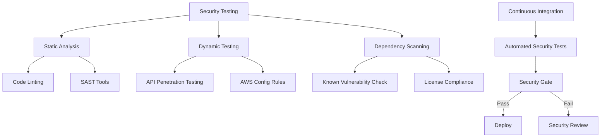

##### 6.3.5 Security Maintenance

| Task | Frequency | Details |
|------|-----------|---------|
| API Key Rotation | 90 days | - Automated key rotation process<br>- Temporary overlap period for transition<br>- Verification of new key functionality |
| Security Patching | Weekly | - Regular updates of all dependencies<br>- Security patch testing in staging environment<br>- Rollback procedures for failed updates |
| Security Audit | Quarterly | - Comprehensive review of security measures<br>- Penetration testing of API endpoints<br>- Validation of AWS security configurations |

### 5. INFRASTRUCTURE

#### 5.1 DEPLOYMENT ENVIRONMENT

The Femtosense Voice Command Generation PoC utilizes a hybrid deployment model:

| Component | Environment | Justification |
|-----------|-------------|---------------|
| Core Application | Local Development | - Faster iteration for development<br>- Direct access to file system for testing<br>- Reduced latency for API calls |
| Storage Backend | Cloud (AWS) | - Scalable storage capacity<br>- Built-in redundancy and backup<br>- Accessibility across development team |
| CI/CD Pipeline | Cloud (AWS) | - Centralized build and deployment<br>- Automated testing and validation<br>- Consistent release process |

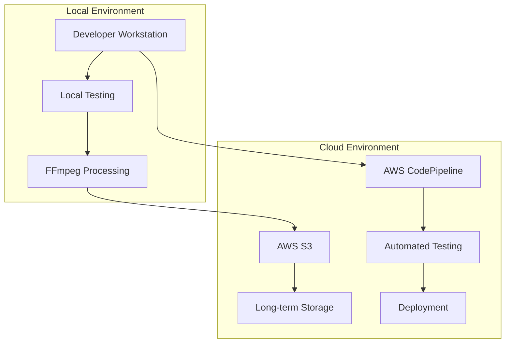

#### 5.2 CLOUD SERVICES

The system leverages the following AWS services:

| Service | Purpose | Configuration |
|---------|---------|---------------|
| AWS S3 | File storage | - Bucket: femtosense-voice-commands<br>- Storage class: Standard<br>- Versioning: Enabled<br>- Encryption: AES-256 |
| AWS Lambda | Serverless processing | - Runtime: Python 3.7<br>- Memory: 1024 MB<br>- Timeout: 5 minutes<br>- VPC access: Enabled |
| AWS CloudWatch | Monitoring and logging | - Log retention: 30 days<br>- Metrics: Custom namespace<br>- Alarms: API quota monitoring |
| AWS IAM | Access management | - Roles: Lambda execution, S3 access<br>- Policies: Least privilege principle<br>- Key rotation: 90 days |

#### 5.3 CONTAINERIZATION

The application uses Docker for consistent development and testing environments:

```dockerfile
FROM python:3.7-slim

# Install FFmpeg and other dependencies
RUN apt-get update && apt-get install -y ffmpeg

# Set working directory
WORKDIR /app

# Copy requirements and install dependencies
COPY requirements.txt .
RUN pip install --no-cache-dir -r requirements.txt

# Copy application code
COPY . .

# Set environment variables
ENV PYTHONUNBUFFERED=1

# Command to run the application
ENTRYPOINT ["python", "narakeet_generate_stt.py"]
```

Container Configuration:

| Aspect | Configuration | Purpose |
|--------|---------------|---------|
| Base Image | python:3.7-slim | Minimal image with required Python version |
| Volume Mounts | /app/data | Persistent storage for input/output files |
| Network | Host network | Direct access to API endpoints |
| Resource Limits | CPU: 2 cores<br>Memory: 4GB | Optimal performance for audio processing |

#### 5.4 ORCHESTRATION

While full Kubernetes orchestration is not required for this PoC, we implement basic container management:

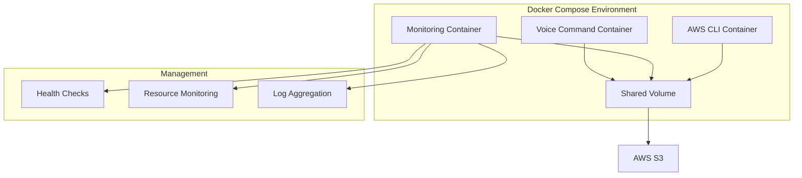

Docker Compose configuration:
```yaml
version: '3.7'
services:
  voice-command:
    build: .
    volumes:
      - ./data:/app/data
    environment:
      - AWS_ACCESS_KEY_ID=${AWS_ACCESS_KEY_ID}
      - AWS_SECRET_ACCESS_KEY=${AWS_SECRET_ACCESS_KEY}
    healthcheck:
      test: ["CMD", "python", "-c", "import requests; requests.get('http://localhost:8080/health')"]
      interval: 30s
      timeout: 10s
      retries: 3

  monitoring:
    image: prom/prometheus
    volumes:
      - ./prometheus.yml:/etc/prometheus/prometheus.yml
    ports:
      - "9090:9090"
```

#### 5.5 CI/CD PIPELINE

The continuous integration and deployment pipeline is implemented using AWS CodePipeline:

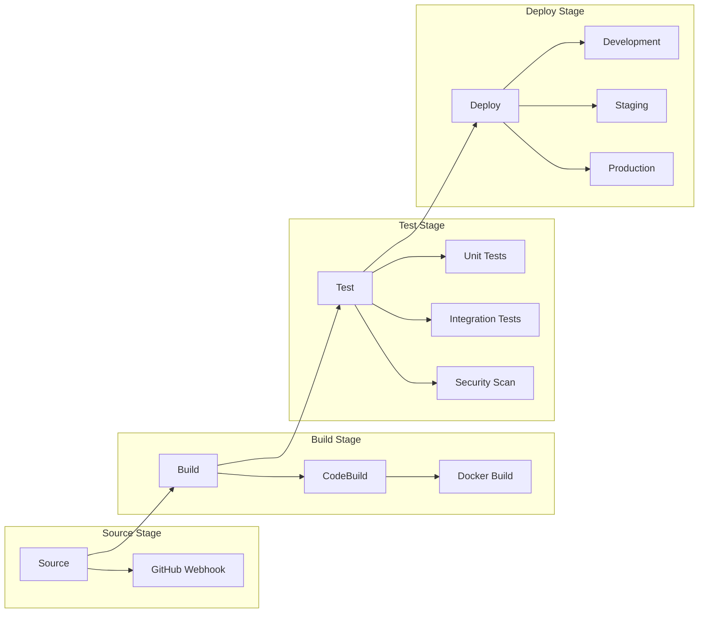

Pipeline Configuration:

| Stage | Tools | Actions |
|-------|-------|---------|
| Source | AWS CodeCommit | - Git repository hosting<br>- Branch protection rules<br>- Automated triggers on push |
| Build | AWS CodeBuild | - Docker image building<br>- Dependency installation<br>- Static code analysis |
| Test | pytest, safety | - Unit test execution<br>- Integration testing<br>- Security vulnerability scanning |
| Deploy | AWS CodeDeploy | - Environment-specific deployments<br>- Rollback capability<br>- Deployment health checks |

Automation Scripts:
```bash
#!/bin/bash
# build.sh
docker build -t femtosense/voice-command:${BUILD_NUMBER} .
docker push femtosense/voice-command:${BUILD_NUMBER}

# test.sh
pytest tests/
safety check

# deploy.sh
aws lambda update-function-code \
  --function-name voice-command-processor \
  --image-uri femtosense/voice-command:${BUILD_NUMBER}
```

### 7. APPENDICES

#### 7.1 ADDITIONAL TECHNICAL INFORMATION

##### 7.1.1 Voice Registry Details

The system utilizes a comprehensive voice registry for managing TTS profiles:

```python
VOICES = {
    "korean": [
        'Chae-Won', 'Min-Ho', 'Seo-Yeon', 'Tae-Hee', 'Joon-Gi',
        'In-Guk', 'Hye-Rim', 'Ji-Sung', 'Jae-Hyun', 'Yoo-Jung',
        'Ji-Yeon', 'Bo-Young', 'Da-Hee', 'Hye-Kyo'
    ],
    "english": {
        "uk": ['Beatrice', 'Nelson', 'Alfred', ...],
        "us": ['Matt', 'Linda', 'Betty', ...],
        "canada": ['Ryan', 'Pamela'],
        # Additional regions omitted for brevity
    },
    "japanese": [
        "Yuriko", "Akira", "Kasumi", "Kenichi", "Tomoka",
        "Takuya", "Takeshi", "Mariko", "Kei", "Ayami",
        "Hideaki", "Kaori", "Kenji", "Kuniko"
    ]
}
```

##### 7.1.2 Distractor Phrase Implementation

The system includes functionality for handling distractor phrases:

```python
def load_csv_distractors(path: str, skip_header: int=0):
    """
    Loads distractor phrases from a CSV file and assigns unique identifiers.
    
    Returns:
    dict: Mapping of Korean phrases to distractor IDs
    """
    with open(path, 'r') as f:
        csv_reader = csv.reader(f)
        data = list(csv_reader)[skip_header:]
        
        phrase2intent = {}
        for i, (korean_phrase, english_phrase) in enumerate(data):
            phrase2intent[korean_phrase] = f'distractor_{i}'
    
    return phrase2intent
```

#### 7.2 GLOSSARY

| Term | Definition |
|------|------------|
| Distractor Phrase | A phrase intentionally similar to a target command, used to test the system's ability to discriminate between valid and invalid commands |
| Voice Profile | A specific voice identity in the TTS system, characterized by language, accent, and other vocal attributes |
| Voice Registry | A structured collection of available voice profiles, organized by language and regional variants |
| Batch Processing | The system's method of processing multiple voice commands in a single execution |
| FFmpeg | A multimedia framework used for handling audio file conversions |
| Intent | The underlying purpose or action associated with a voice command |
| Variation | A different phrasing of the same command that maintains the original intent |

#### 7.3 ACRONYMS

| Acronym | Expanded Form | Context |
|---------|---------------|---------|
| API | Application Programming Interface | Used for GPT-4o and Narakeet interactions |
| AWS | Amazon Web Services | Cloud infrastructure provider |
| CSV | Comma-Separated Values | Format for input files |
| GPT | Generative Pre-trained Transformer | AI model for generating command variations |
| IAM | Identity and Access Management | AWS security service |
| JSON | JavaScript Object Notation | Data format for API communications |
| M4A | MPEG 4 Audio | Intermediate audio format |
| PCM | Pulse-Code Modulation | Audio encoding format |
| PoC | Proof of Concept | Project development phase |
| S3 | Simple Storage Service | AWS storage service |
| SDK | Software Development Kit | Tools for AWS integration |
| TLS | Transport Layer Security | Network security protocol |
| TTS | Text-to-Speech | Audio generation technology |
| UTF-8 | Unicode Transformation Format - 8-bit | Character encoding |
| WAV | Waveform Audio File Format | Final audio file format |

#### 7.4 COMMAND LINE EXAMPLES

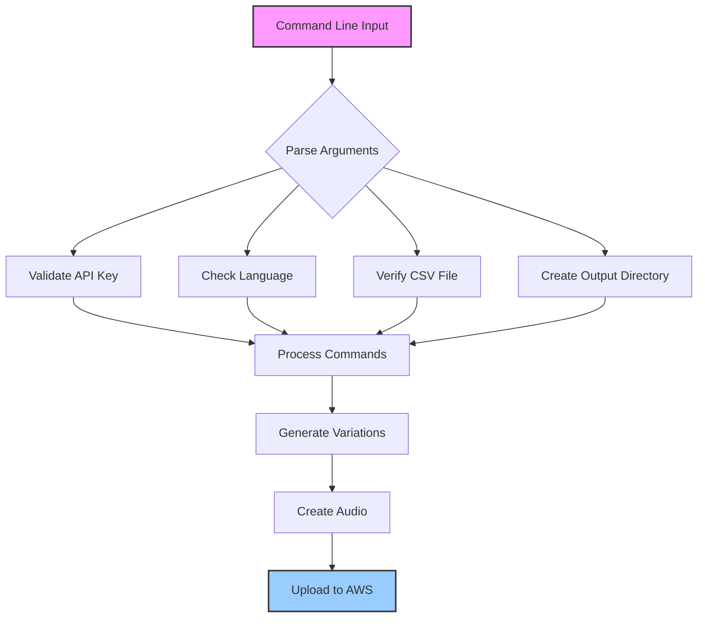

Example commands and their purposes:

| Command | Purpose |
|---------|---------|
| `python narakeet_generate_stt.py --apikey PJNGN13X... --language korean --intent_csv example.csv --outdir test` | Standard execution |
| `python narakeet_generate_stt.py --help` | Display help information |
| `python narakeet_generate_stt.py --apikey PJNGN13X... --language english --intent_csv wakeword.csv --outdir wake_test` | Generate wake word variations |
| `python narakeet_generate_stt.py --apikey PJNGN13X... --language japanese --intent_csv commands.csv --outdir jp_test --skip_header 2` | Process Japanese commands, skipping 2 header rows |

#### 7.5 FILE STRUCTURE EXAMPLES

AWS S3 Storage Organization:
```
femtosense-voice-commands/
├── korean/
│   ├── LIGHTS_ON/
│   │   ├── 불-켜줘/
│   │   │   ├── Chae-Won.wav
│   │   │   ├── Min-Ho.wav
│   │   ├── 조명을-켜주세요/
│   │   │   ├── Seo-Yeon.wav
│   ├── LIGHTS_OFF/
│   │   ├── 불을-꺼주세요/
│   │   │   ├── Tae-Hee.wav
├── english/
│   ├── WAKE_WORD/
│   │   ├── ok-google/
│   │   │   ├── Matt.wav
│   │   │   ├── Linda.wav
```

Local Temporary Storage:
```
/tmp/femtosense_poc/
├── processing/
│   ├── current_batch.json
│   ├── audio_queue.txt
├── output/
│   ├── failed_uploads.log
│   ├── generation_stats.json
```